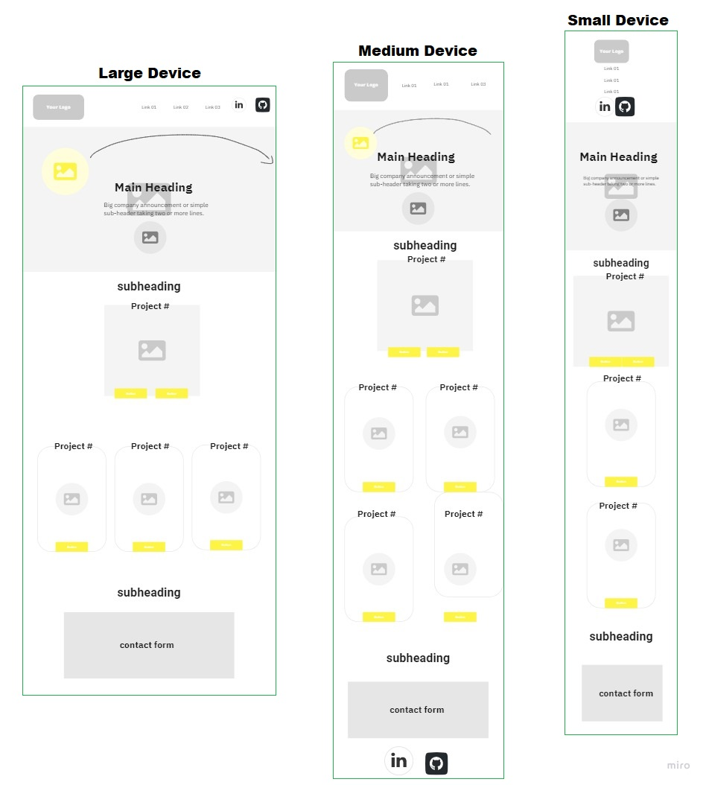

# Fahra's Coding Portfolio

A fully responsive, functional website containing all projects completed by myself.

#### You can view the deployed website by [clicking here!](https://fudge88.github.io/coding-portfolio/)

Your portfolio is a way to communicate your skills, but it’s also a way to communicate your personality, your goals and how you got to where you are.

_The following animation shows the web application's appearance and functionality:_


## Summary

An effective portfolio highlighting projects to date, as well as the thought processes behind them. These are deployed web applications (meaning they are live on the web), where the user is able to view projects and and the code behind it by a single click.

## User Story

```
AS AN employer
I WANT to view a potential employee's deployed portfolio of work samples
SO THAT I can review samples of their work and assess whether they're a good candidate for an open position
```

## Acceptance Criteria

```
GIVEN I need to sample a potential employee's previous work
WHEN I load their portfolio
THEN I am presented with the developer's name, a recent photo or avatar, and links to sections about them, their work, and how to contact them
WHEN I click one of the links in the navigation
THEN the UI scrolls to the corresponding section
WHEN I click on the link to the section about their work
THEN the UI scrolls to a section with titled images of the developer's applications
WHEN I am presented with the developer's first application
THEN that application's image should be larger in size than the others
WHEN I click on the images of the applications
THEN I am taken to that deployed application
WHEN I resize the page or view the site on various screens and devices
THEN I am presented with a responsive layout that adapts to my viewport
```

## Tools Used:

- Flexbox
- Media queries
- Font awesome
- Google fonts
- Keyframes

#### Languages:

- HTML
- CSS

#### Flexbox

The main idea behind the flex layout is to give the container the ability to alter its items’ width/height (and order) to best fill the available space (mostly to accommodate to all kind of display devices and screen sizes). A flex container expands items to fill available free space or shrinks them to prevent overflow.

The following image shows the web application's cards that were created using Flexbox.


Since flexbox is a whole module and not a single property, it involves a lot of things including its whole set of properties. Some of them are meant to be set on the container (parent element, known as “flex container”) whereas the others are meant to be set on the children (said “flex items”).

If “regular” layout is based on both block and inline flow directions, the flex layout is based on “flex-flow  
directions”.

## Wireframes

The use of wireframes helps to create a visual format of the end product, this is a rough guide of  
how the finished site should aim to look.



These wireframes were created using [miro](https://miro.com/app/dashboard/) this allowed me to create a large, medium and a small screen mock-up of how my portfolio would look. The main difference between the different screen sizes
is the number of columns used to display my projects.

## Features

- Apart from using the functionality of 'Flexbox' for the responsiveness of the site.
- I used `@media` queries to help tune the styling for specific screen width ranges. I used `@media` queries to hide the social icons from appearing on the navbar for the screen range of 576px to 767.98px, for this the social icons appear in the footer instead.
- I also used `@keyframes` to create an animation targeting the moon image instructing it to float across the page.

## references

[Flexbox positioning](https://developer.mozilla.org/en-US/docs/Web/CSS/CSS_Flexible_Box_Layout/Aligning_Items_in_a_Flex_Container)

[Opening links in new tab](https://stackoverflow.com/questions/17711146/how-to-open-link-in-a-new-tab-in-html)

[Looping keyframes](https://stackoverflow.com/questions/25384314/how-do-i-loop-a-css-animation-with-multiple-keyframe-definitions)

[Hover: transition](https://travis.media/how-to-make-an-item-grow-on-hover-with-css/)

[Link glow effect](https://codersblock.com/blog/creating-glow-effects-with-css/)

[Contact Form](https://www.w3docs.com/tools/editor/5876)

[Webm to Gif converter](https://cloudconvert.com/webm-to-gif)

[Markdown cheat sheet](https://www.markdownguide.org/cheat-sheet/)

[Screencastify - screen recording](https://www.screencastify.com/)

## License

This project is licensed under the terms of the MIT license.
